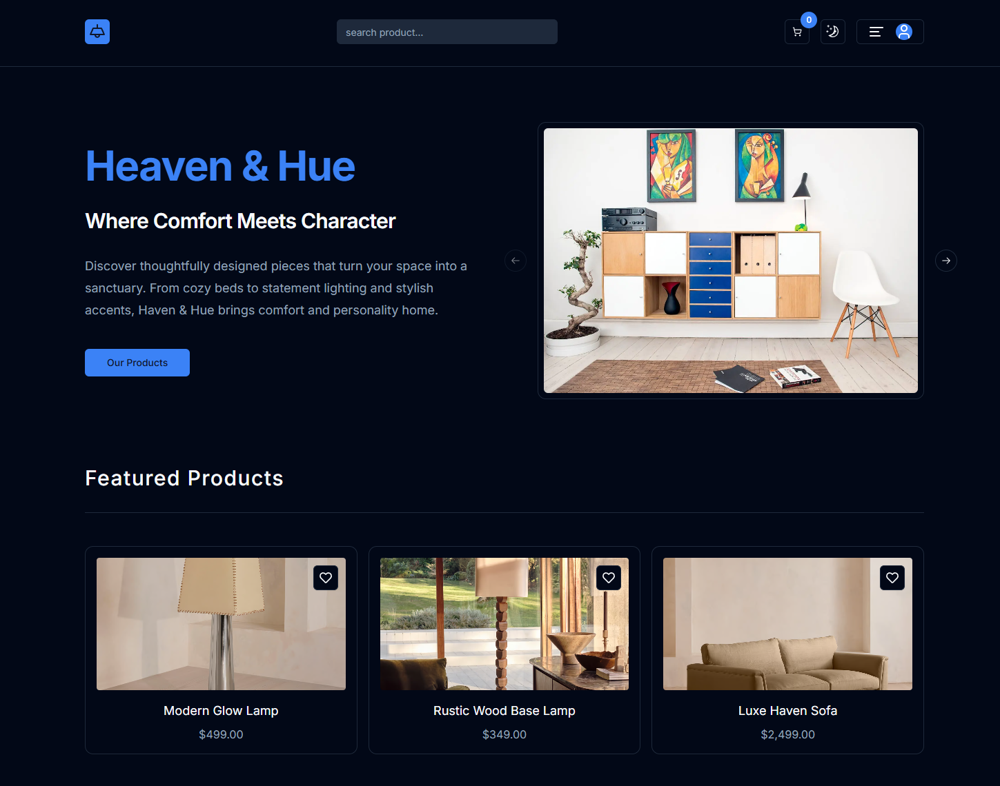
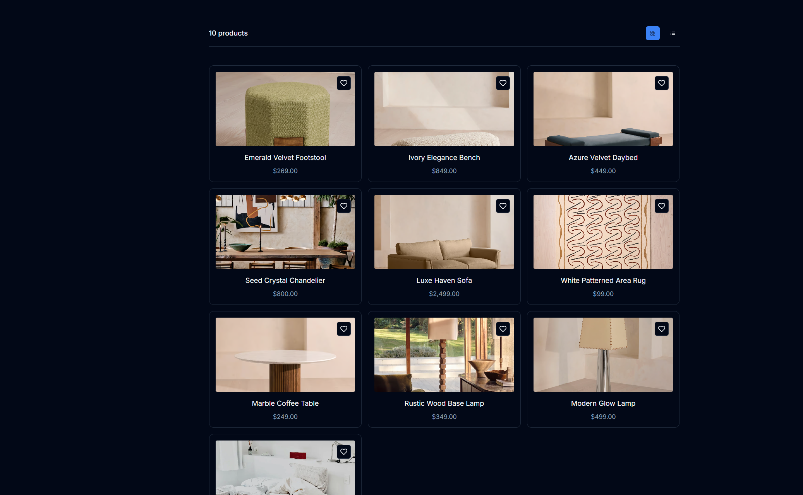
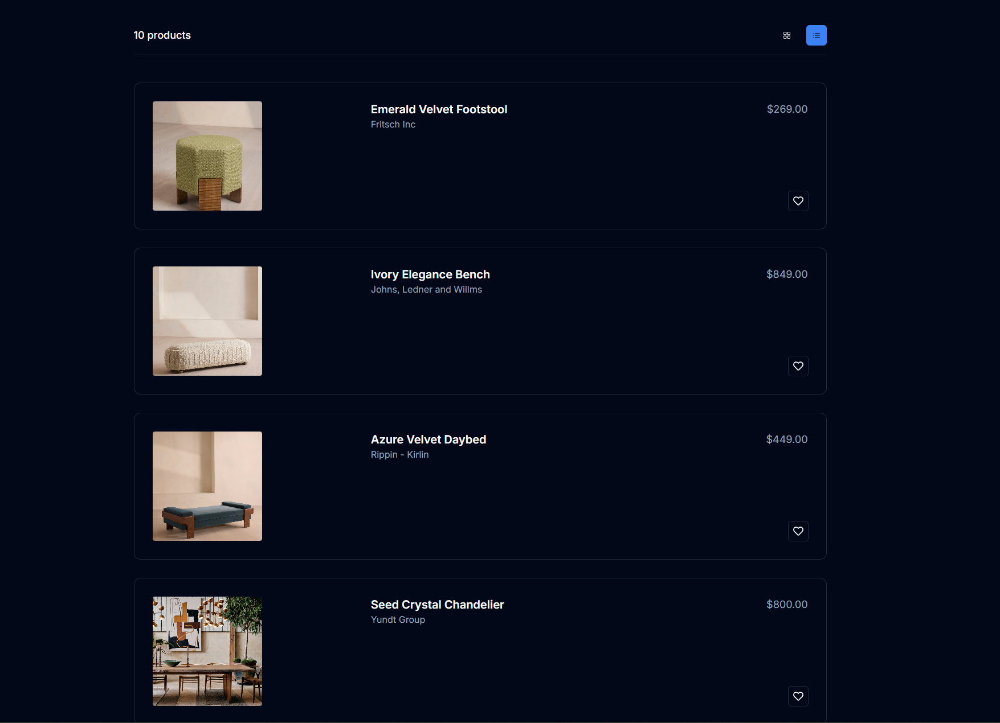
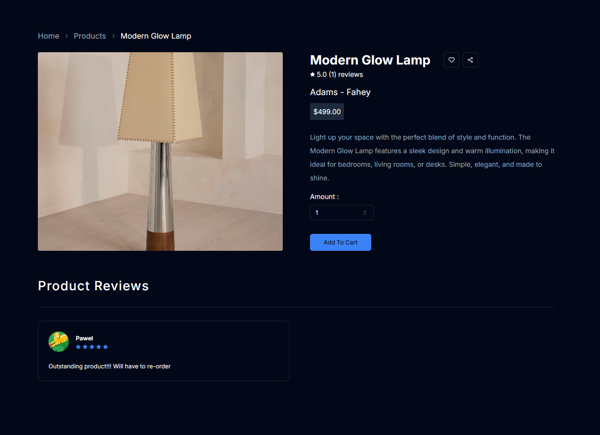
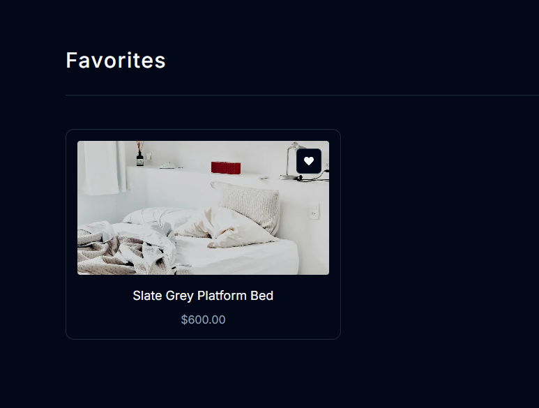
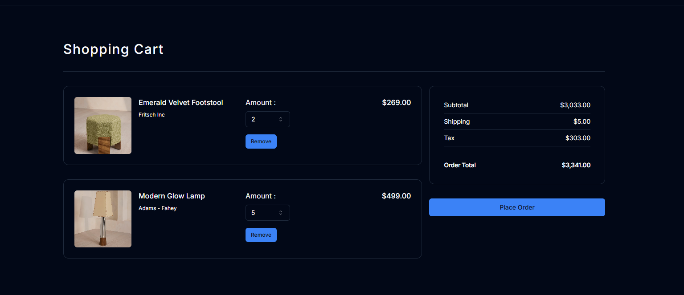
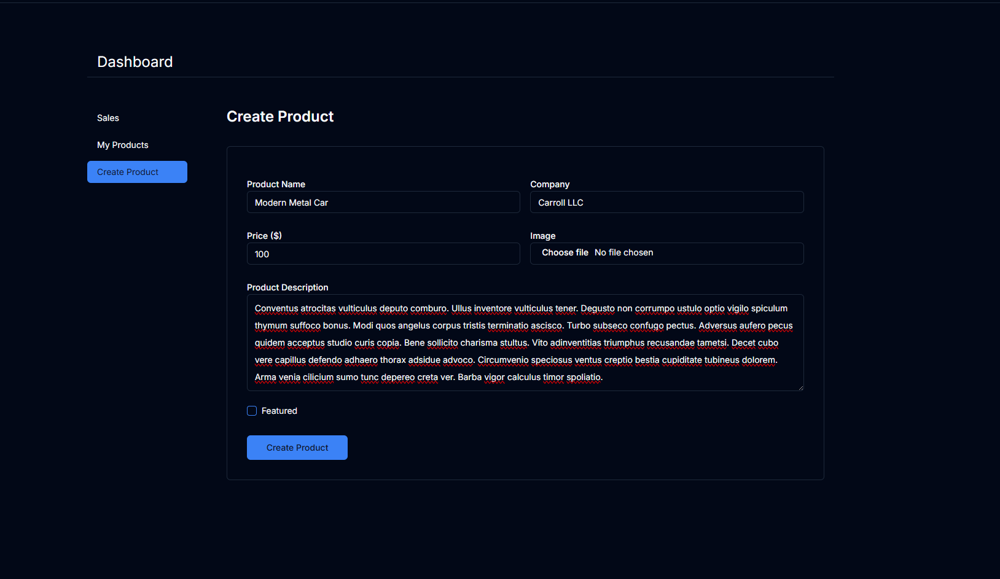
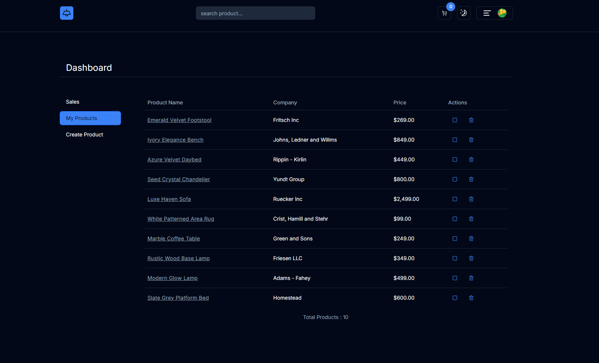

# Heaven & Hue

## Table of Contents

* [About The Project](#about-the-project)
    * [Key Features](#key-features)
* [Built With](#built-with)
* [What I Learned](#what-i-learned)
* [Challenges Faced](#challenges-faced)
* [Screenshots & Demo](#screenshots--demo)
* [Future Enhancements](#future-enhancements)
* [Contact](#contact)
* [License](#license)
* [Acknowledgements](#acknowledgements)

---

## About The Project

Heaven & Hue is a modern and intuitive **e-commerce platform** designed to offer a seamless shopping experience for furniture and home decor. Our goal is to help users find the perfect items to enhance their living spaces, blending heavenly aesthetics with vibrant hues to create a truly unique home environment. The platform is robust, featuring distinct user and admin functionalities to ensure efficient management and a smooth customer journey.

This project serves as a comprehensive demonstration of full-stack development skills, showcasing the ability to build, deploy, and manage a real-world application.

### Key Features

#### Customer-Facing Features:

* **User Authentication:** Secure login via **Clerk/nextjs** for customers to manage their accounts, view order history, and save favorite items.
* **Product Search & Filter:** A powerful search bar allows users to quickly find specific products.
* **Product Catalog:** Browse a comprehensive catalog of furniture items with detailed descriptions.
* **Customer Reviews:** Users can leave a **single review per product**, which is saved and visible to all.
* **Favorites/Wishlist:** Customers can add desired items to a favorites list for future reference.
* **Dynamic Product Display:** View products in both **list and grid styles** on category pages for flexible Browse.
* **Detailed Product Pages:** Each product has a dedicated page with high-resolution images, detailed descriptions, pricing, quantity selection, and the option to add to cart.
* **Shopping Cart:** A persistent shopping cart allows users to manage their selections before checkout.
* **Secure Checkout:** Seamless and secure payment processing integrated with **Stripe** for a smooth purchasing experience.
* **Homepage Carousel:** Engage users with a dynamic carousel showcasing popular or new arrivals.
* **Featured Products Section:** Highlight curated products directly on the homepage.

#### Admin-Facing Features:

* **Admin Dashboard:** A dedicated, secure dashboard for administrators to manage the store.
* **Product Management (CRUD):** Admins can effortlessly **Create, Read, Update, and Delete** product listings.
* **Sales Report:** Access comprehensive sales reports to monitor performance and track revenue.

---

## Built With

This project leverages a modern and powerful technology stack to ensure a fast, scalable, and maintainable application.

* **Frontend Framework:** [Next.js](https://nextjs.org/)
* **Language:** [TypeScript](https://www.typescriptlang.org/)
* **Styling:** [Tailwind CSS](https://tailwindcss.com/)
* **UI Components:** [Shadcn/UI](https://ui.shadcn.com/)
* **Database:** [Supabase](https://supabase.com/)
* **Payment Gateway:** [Stripe](https://stripe.com/)
* **Authentication:** [Clerk.dev](https://clerk.com/) (`@clerk/nextjs`)
* **API Client:** [Axios](https://axios-http.com/)
* **Schema Validation:** [Zod](https://zod.dev/)

---

## What I Learned

Building Heaven & Hue was an invaluable learning experience that significantly deepened my understanding of modern web development and e-commerce architecture. Key takeaways include:

* **Full-Stack Application Development:** Gained hands-on experience in connecting frontend (Next.js, TypeScript) with a backend (Supabase) and third-party services (Stripe, Clerk).
* **Next.js Server Components & Data Fetching:** Mastered efficient data fetching strategies in Next.js, including server-side rendering (SSR) and static site generation (SSG) concepts for performance optimization.
* **Type Safety with TypeScript:** Proficiently applied TypeScript to build a robust and less error-prone codebase, enhancing maintainability and developer experience.
* **Database Management with Supabase:** Learned to design schemas, manage data, and interact with a PostgreSQL database via Supabase, including real-time capabilities.
* **Secure Authentication Flows:** Implemented comprehensive user authentication and authorization using Clerk, understanding best practices for managing user sessions and access control.
* **Payment Gateway Integration:** Successfully integrated **Stripe** for secure and efficient payment processing, including webhook handling for order fulfillment.
* **Modern UI Development:** Utilized **Tailwind CSS** for rapid and consistent styling and **Shadcn/UI** for building beautiful, accessible, and reusable UI components.
* **Schema Validation:** Leveraged **Zod** for robust data validation, ensuring data integrity across the application.
* **API Design & Consumption:** Developed and consumed RESTful APIs (or equivalent patterns with Next.js API routes) for seamless communication between frontend and backend.
* **Project Structure & Scalability:** Gained insights into structuring a larger application for maintainability, scalability, and future feature additions.

---

## Challenges Faced

Developing Heaven & Hue presented several interesting challenges that pushed my problem-solving skills and deepened my understanding of the technology stack:

* **Complex State Management (Frontend):** Managing intricate UI states, especially concerning the shopping cart, product filters, and admin dashboard forms, required careful planning to ensure reactivity and consistency.
* **Stripe Webhook Implementation:** Correctly configuring and securing Stripe webhooks to reliably update order statuses and manage inventory after successful payments presented a significant learning curve regarding asynchronous operations and security.
* **Optimizing Database Queries with Supabase:** Initially, some database queries were inefficient. Optimizing these (e.g., proper indexing, efficient join operations) to ensure fast load times for product listings and admin reports was a critical task.
* **Authentication & Authorization Logic:** Implementing distinct access controls for customer vs. admin roles using Clerk, and ensuring sensitive admin routes were truly protected, required a deep dive into middleware and server-side checks.
* **Responsive Design Across Devices:** Achieving a consistent and appealing user experience across various screen sizes using Tailwind CSS and Shadcn/UI required meticulous attention to detail and iterative adjustments.
* **Image Handling & Optimization:** Efficiently managing product images (uploading, storing, and serving optimized versions) while maintaining performance was a challenge that led to exploring solutions like Cloudinary (if you used it, or just general image optimization techniques).
* **Form Validation with Zod:** While powerful, accurately defining and integrating complex validation schemas with Zod for both client-side and server-side form submissions for product creation/editing required careful thought.

---

## Screenshots

Experience Heaven & Hue in action! Below are screenshots showcasing key functionalities.

### Homepage

### Product Page

### Product Page List View

### Product Detail Page

### Favorites Page

### Cart Page

### ADMIN Create Product Page

### ADMIN Edit Product Page

## Future Enhancements

We are continuously looking to improve Heaven & Hue. Potential future enhancements include:

* Advanced filtering options (e.g., by material, dimensions, brand).
* Customer support chat integration.
* Wishlist functionality synchronized across devices.
* User reviews with image uploads.
* Integration with shipping APIs for real-time tracking.
* Recommendation engine based on Browse history.
* Newsletter subscription integration.

---

## Contact

* **pawelkozubal:** [Your GitHub Profile Link](https://github.com/pawelkozubal)
* **Project Link:** [Heaven & Hue Repository](https://github.com/pawelkozubal/store) ---

## License

Distributed under the MIT License. See `LICENSE.txt` for more information.

---

## Acknowledgements

* [Next.js Documentation](https://nextjs.org/docs)
* [Supabase Documentation](https://supabase.com/docs)
* [Stripe Documentation](https://stripe.com/docs)
* [Clerk Documentation](https://clerk.com/docs)
* [Shadcn/UI Documentation](https://ui.shadcn.com/docs)
* [Tailwind CSS Documentation](https://tailwindcss.com/docs)
* [Zod Documentation](https://zod.dev/)

---